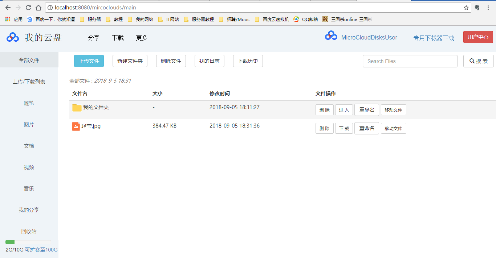
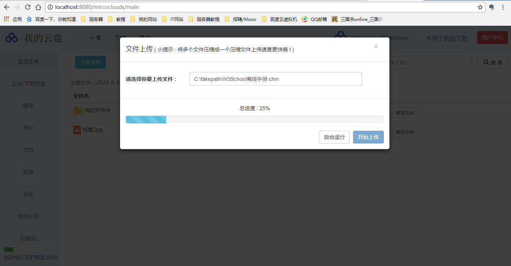
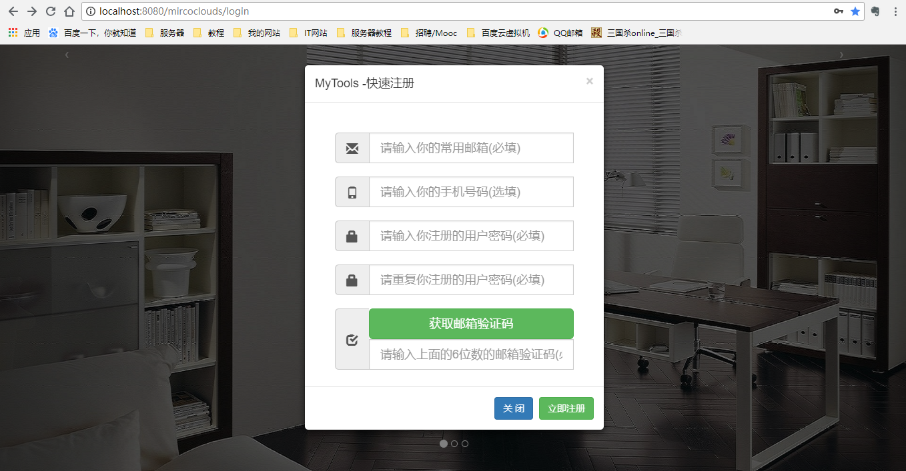

# MicroClouds

 版本正在升级 ! 将启用Spring Boot + Shiro + Redis , 2018年12月19日开始更改,预计很快就完成更改 , 此次改动幅度较大, 所以新建了一个仓库 , 
 
 可以到此处查看每次的提交 : https://github.com/Fanqie22/microclouds-spring-boot
 
 此次更新将带来 : 
 
1. 启用强大的Spring Boot ,告别几乎所有的Spring 配置 .

2. 启用安全框架 Shiro ,管理 认证/权限/密码/会话 ,更安全 .

3. 启用Redis 缓存数据 .

4. 抛弃臃肿的 JSP , 使用 Thymeleaf 渲染视图 , Thymeleaf可完全替代 JSP .

5. 更好更高效的代码, 遵循阿里巴巴Java开发手册规范代码 , 这将会大幅修改代码, 注重注释, 尽量多写有质量的代码和注释 .

6. 更好的UI界面, 利用现有资源, 修改Web界面, 加入更合理的布局, 更美观的UI, 这将重新设计网页页面UI . 

7. 同时会保留旧项目的源码,不过旧代码也会根据阿里巴巴Java开发手册进行代码优化规范,适合初学者学习,并且可以作为期末作业的参考,旧代码仓库到时候会更新

8. 大幅优化POJO类, SQL语句, 表结构 . 最后会贴出相关表的SQL创建语句 .

9. 敬请期待 ! 

Windows桌面版下载器地址 :  https://github.com/Fanqie22/Microclouds-Downloader ,可多线程断点下载 ,功能完善之后可连通数据库,上传/下载/管理文件更方便 (未完成)

一个基于Spring/SpringMVC/Mybatis的云盘项目, 提供上传/下载/文件管理服务 .
使用Spring/SpringMVC/MyBatis框架搭建，通过配置SpringMVC DispatchServlet，实现ProgressListener接口，重写CommonsMultipartResolver方法实现文件上传进度监听 。可通过完整的文件逻辑系统管理用户文件 ，基于ResponseEntity实现用户下载。用户可通过web页面上传、下载、管理文件，也可以通过Windows版的下载器快速下载文件 ，下载器使用Java /Java Swing开发，支持多线程，可断点下载，用户可根据电脑情况自定义线程数。

旧界面 : 

主页

上传页

注册页

登录页

